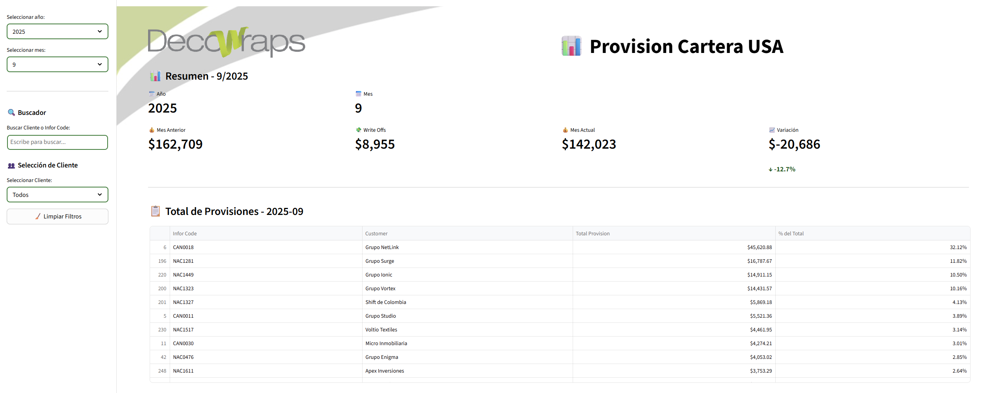
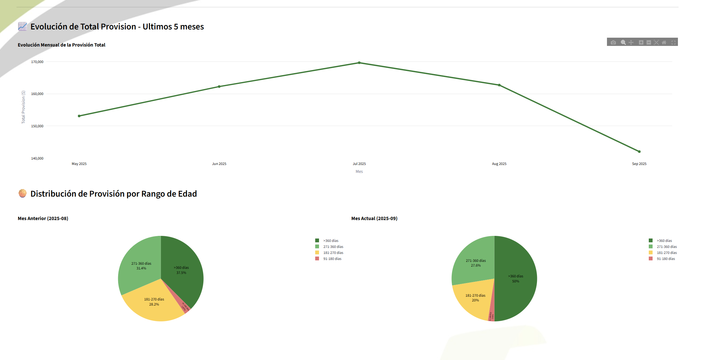

# 📊 Provision Cartera USA 

Este proyecto es una aplicación interactiva desarrollada con **Streamlit**, diseñada para visualizar, auditar y analizar la provisión de cartera de clientes en EE. UU. a partir de modelos de datos financieros estructurados. 

La plataforma permite realizar un seguimiento crítico de la maduración de saldos vencidos y automatizar el cálculo de provisiones bajo reglas de negocio dinámicas, optimizando el análisis del flujo de caja.

---

## 🚀 Funcionalidades Actuales & Interfaz

### 📈 Dashboard Ejecutivo y Métricas Clave
* **Comparación Mensual Automática:** Análisis de variaciones (*Month-over-Month*) con tarjetas de métricas interactivas para decisiones de FP&A en tiempo real.
* **Evolución Temporal:** Gráfico de líneas dinámico que proyecta la tendencia histórica de la provisión total.



### 🧮 Motor de Cálculo Dinámico y Distribución de Riesgo
* **Segmentación por Rangos de Maduración:** Cálculo automático de provisiones basado en condiciones específicas de días de vencimiento y año fiscal:
  * **91–180 días:** 20% (2024) / 3% (2025)
  * **181–270 días:** 50%
  * **271–360 días:** 50% (2024) / 100% (2025)
  * **> 360 días:** 100%
* **Análisis Visual de Cartera:** Gráfico de barras apiladas interactivas que expone la distribución de exposición al riesgo por rango y por mes.



### 📑 Auditoría Detallada de Clientes
* **Data Drill-Down:** Tabla interactiva del último mes con opciones de filtrado automático para los años 2024 y 2025, permitiendo conciliar saldos a nivel corporativo de forma segura.

---

## 🧩 Tecnologías Utilizadas

* **Python 3.13+**
* **Streamlit** (Interfaz de usuario y reactividad)
* **Pandas** (Procesamiento, limpieza y modelado de datos)
* **Plotly Express** (Visualizaciones dinámicas e interactivas)

---

## ⚙️ Cómo Ejecutar el Proyecto Localmente

1. **Clonar este repositorio:**
   ```bash
   git clone [https://github.com/nicko89/provision-cartera-usa.git](https://github.com/nicko89/provision-cartera-usa.git)
   cd provision-cartera-usa
Crear y activar un entorno virtual:

Bash
python -m venv .venv
# En macOS/Linux:
source .venv/bin/activate 
# En Windows:
.venv\Scripts\activate
Instalar dependencias:

Bash
pip install -r requirements.txt
Ejecutar la aplicación:

Bash
streamlit run App.py
📁 Estructura del Proyecto
Plaintext
provision-cartera-usa/
│
├── Data/
│   └── Base Provision.xlsx   # Datos fuente (Enmascarados por seguridad)
├── Screenshots/
│   ├── kpis.png              # Captura de indicadores de la App
│   └── graficos.png          # Captura de visualizaciones analíticas
├── App.py                    # Código principal y lógica de Streamlit
├── requirements.txt          # Dependencias del entorno
└── README.md                 # Documentación del proyecto
🧠 Roadmap / Próximos Pasos
🔒 Seguridad Corporativa: Migración de arquitectura hacia Azure para habilitar accesos internos controlados bajo políticas de gobierno de datos empresariales.

☁️ Integración Cloud (Modern Data Warehouse): Implementación de conexiones nativas mediante Microsoft Fabric para la ingesta y transformación automatizada de datos desde orígenes globales.

🌐 Despliegue Local Seguro: Validación de túneles híbridos mediante NGROK para pruebas controladas de la aplicación en red interna.

Nota de Seguridad: Toda la información expuesta en este repositorio público utiliza técnicas de enmascaramiento de datos. Los nombres de clientes, corporaciones y montos financieros son 100% ficticios y generados exclusivamente con fines de demostración técnica de la herramienta.

🧑‍💻 Autor
Desarrollado por: Nicolás Cabral

Rol: Analista Financiero & Especialista en Data Analytics

Contacto: 📧 nickabral@gmail.com | GitHub Profile
